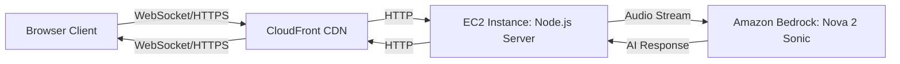

# Voice AI Calling Agent

[](LICENSE)
[](https://nodejs.org)
[](https://aws.amazon.com/bedrock/)

Real-time conversational agent application with natural voice interactions powered by WebSocket streaming and Amazon Bedrock.

## Features

- **Real-time Voice Conversation**: Seamless speech-to-speech interaction
- **Multiple AI Agents**: Pre-configured agents for different use cases
- **WebSocket Streaming**: Low-latency bidirectional communication
- **AWS Bedrock Integration**: Powered by Amazon Nova 2 Sonic model
- **Production Ready**: CloudFormation templates for AWS deployment

## Architecture



### Component Details

| Component | Technology | Purpose |
|-----------|-----------|---------|
| Frontend | HTML5/JavaScript | Audio capture and playback |
| WebSocket Server | Node.js + TypeScript | Real-time communication |
| CDN | AWS CloudFront | Global content delivery |
| Compute | AWS EC2 | Application hosting |
| AI Model | Amazon Bedrock (Nova 2 Sonic) | Voice AI processing |

## Prerequisites

- Node.js v24 (tested version)
- AWS account with Amazon Bedrock access
- Modern browser with microphone support

## Quick Start

### Local Development

```bash
# 1. Clone the repository
git clone <repository-url>
cd websocket-nodejs

# 2. Install dependencies
cd app
npm install

# 3. Configure AWS credentials
export AWS_PROFILE=your-profile-name

# 4. Build the application
npm run build

# 5. Start the development server
npm start
```

Open [http://localhost:3000](http://localhost:3000) in your browser and allow microphone access.

### Production Deployment

For AWS EC2 deployment with CloudFormation, see the detailed guide:

**[AWS Deployment Guide](DEPLOYMENT.md)**

## Using Different Agents

Access different conversational agents via URL parameter:

| Agent | URL Parameter | Description |
|-------|--------------|-------------|
| Default | (none) | General purpose assistant |
| Santa Claus | `?prompt=santa_claus_adult` | Holiday-themed conversational agent |
| Sales Assistant | `?prompt=asistente_ventas` | Sales and customer service agent |
| Hotel Cancellation | `?prompt=hotel_cancel` | Hotel booking management agent |

**Example:**
```
http://localhost:3000/?prompt=santa_claus_adult
```

Custom agents can be created in [app/agents/](app/agents/). See the existing `.toml` files for reference.

## Contributing

Contributions are welcome! Please feel free to submit a Pull Request.

## License

See [LICENSE](LICENSE)
